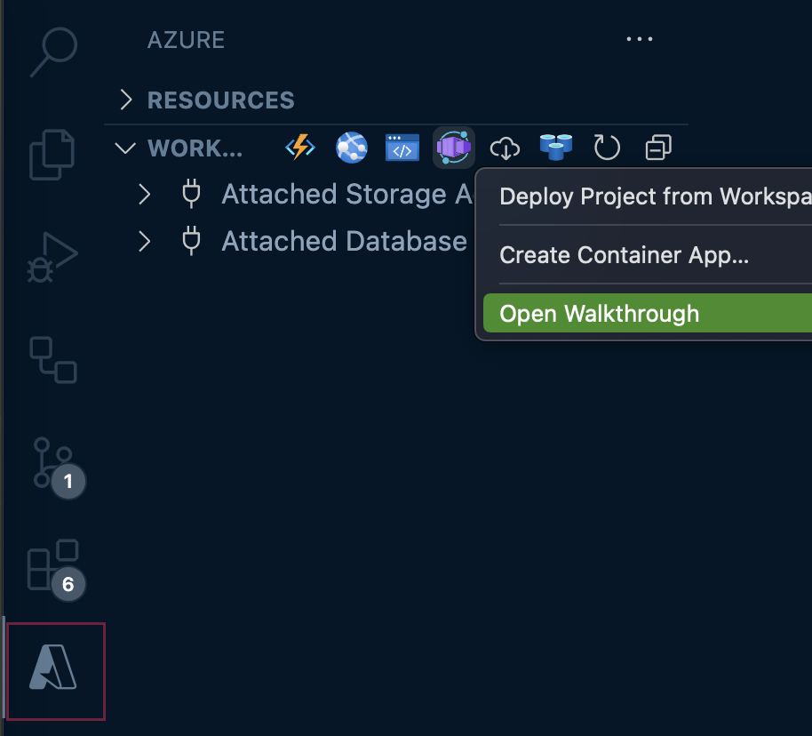
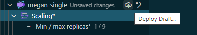

# Azure Container Apps for Visual Studio Code

<!-- region exclude-from-marketplace -->

  

<!-- endregion exclude-from-marketplace -->

Use the Azure Containers extension to quickly create and deploy containerized apps directly from VS Code. Check out the [Azure Samples repository](https://aka.ms/ContainerAppsSamples) to view sample projects.

> Sign up today for your free Azure account and receive 12 months of free popular services, $200 free credit and 25+ always free services 👉 [Start Free](https://azure.microsoft.com/free/open-source).

## Create your first container app

Use the `Deploy Project from Workspace...` command to simplify the process of deploying a local workspace project to a container app!  By analyzing your project directory, we automatically detect any Dockerfiles and generate all the necessary Azure resources required for creating a containerized application (monorepo support now included!).

Please follow our onboarding walkthrough to get started. You can access the walkthrough using either of the following methods:
* Click the workspace container apps icon and run `Open Walkthrough`

    

* Open through the command palette `F1 > Azure Container Apps: Open Walkthrough`

You can re-run the command with your saved workspace settings to quickly re-deploy your project to any previously saved Azure resources.

__Note__: We also have entry-points on the container apps environment item (`Create Container App from Workspace`) and the container app item (`Deploy Workspace to Container App`).  These commands offer an alternative way to quickly target project deployment to existing resources.

## Edit and deploy your app

_Draft support has only been added for these actions: Scaling commands, Update Container Image..., Edit Container App (Advanced)_

1. Make a supported edit to your container app. In this example we will be editing the scaling range.
1. Changes made to your container app will be reflected by the appended "*" and the "Unsaved changes" tag added to the container app

    

1. More changes can be made and deployed together!
1. Deploy these changes to your container app by clicking the cloud icon located next to your container app

    
1. Once your deployment has completed your changes should accurately be reflected in the Azure view!

<!-- region exclude-from-marketplace -->

## Contributing

There are a couple of ways you can contribute to this repo:

* **Ideas, feature requests and bugs**: We are open to all ideas and we want to get rid of bugs! Use the Issues section to either report a new issue, provide your ideas or contribute to existing threads.
* **Documentation**: Found a typo or strangely worded sentences? Submit a PR!
* **Code**: Contribute bug fixes, features or design changes:
  * Clone the repository locally and open in VS Code.
  * Run "Extensions: Show Recommended Extensions" from the [command palette](https://code.visualstudio.com/docs/getstarted/userinterface#_command-palette) and install all extensions listed under "Workspace Recommendations"
  * Open the terminal (press <kbd>CTRL</kbd>+ <kbd>\`</kbd>) and run `npm install`.
  * To build, press <kbd>F1</kbd> and type in `Tasks: Run Build Task`.
  * Debug: press <kbd>F5</kbd> to start debugging the extension.

### Legal

Before we can accept your pull request you will need to sign a **Contribution License Agreement**. All you need to do is to submit a pull request, then the PR will get appropriately labelled (e.g. `cla-required`, `cla-norequired`, `cla-signed`, `cla-already-signed`). If you already signed the agreement we will continue with reviewing the PR, otherwise system will tell you how you can sign the CLA. Once you sign the CLA all future PR's will be labeled as `cla-signed`.

### Code of Conduct

This project has adopted the [Microsoft Open Source Code of Conduct](https://opensource.microsoft.com/codeofconduct/). For more information see the [Code of Conduct FAQ](https://opensource.microsoft.com/codeofconduct/faq/) or contact [opencode@microsoft.com](mailto:opencode@microsoft.com) with any additional questions or comments.

<!-- endregion exclude-from-marketplace -->

## Telemetry

VS Code collects usage data and sends it to Microsoft to help improve our products and services. Read our [privacy statement](https://go.microsoft.com/fwlink/?LinkID=528096&clcid=0x409) to learn more. If you don’t wish to send usage data to Microsoft, you can set the `telemetry.enableTelemetry` setting to `false`. Learn more in our [FAQ](https://code.visualstudio.com/docs/supporting/faq#_how-to-disable-telemetry-reporting).

## Lifecycle

The Azure Container Apps extension for VS Code follows the [Modern Lifecycle Policy](https://docs.microsoft.com/lifecycle/policies/modern). Follow instructions [here](https://code.visualstudio.com/docs/editor/extension-gallery) to get the latest updates of the extension.

## License

[MIT](LICENSE.md)
