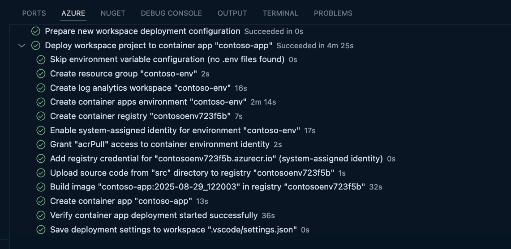

| Prompt | Value |
|--------|-------|
| Select subscription | Select the Azure subscription you want to use. |
| Select a container apps environment | Select: <b>Create new container apps environment</b>. You will only be asked this question if you have existing container apps environments. |
| Confirm resources to create | Select: <b>Continue</b> |
| Enter a name for the new container app environment resources | Enter: <b>my-container-env</b> |
| Enter a name for the new container app | Enter: <b>my-container-app</b> |
| Provide a source code directory for upload | Select: <b>./src</b> |
| Select a location | Select an Azure region close to you. |
| Save deployment configuration | Select: <b>Save</b> |
| <i>On completion<i>: | 

View Save Configuration: 

`.vscode/settings.json`:

 

View Activity Log: 

 

View Deployment: 

 

View Azure Resources Tree (Resource Type): 

 

View Azure Resources Tree (Resource Group): 

 |
