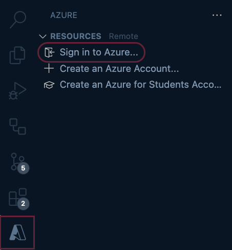
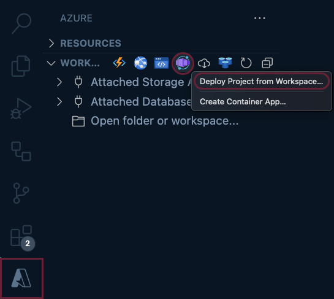

| Step summary... | Where it's located... |
|-----------------|-----------------------|
| <h4>I. <u>Add a workspace project</u></h4>Navigate to the Explorer view and add a project with a Dockerfile to the local VS Code workspace using <b>Open Folder</b> or <b>Clone Repository</b>. |  |
| <h4>II. <u>Sign in to Azure</u></h4>Navigate to the Azure Resources view and select: <b>Sign in to Azure</b>. | 
 |
| <h4>III. <u>Create and deploy</u></h4>Navigate to the Azure Workspace view and use the container app icon to select: <b>Deploy Project from Workspace</b>.  Re-deploy to the same resources by running the command again with saved workspace settings (<i>.vscode/settings.json</i>). |  |
